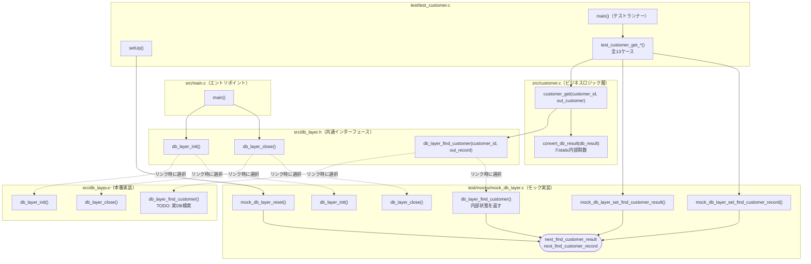

# 顧客情報参照AP 関数関連図

design.md（Phase 2設計書）に基づく関数の呼び出し関係図。
`customer_get()`/`convert_db_result()`は実装済み（design.md 8節の処理フロー通り）。
`db_layer.c`（本番のDB接続処理）のみ、requirements.md 1節でOracle DB本体の実装が
対象外とされているため、引き続き空実装（TODO）のまま。

## 凡例

| 表記 | 意味 |
|---|---|
| 実線矢印 (`-->`) | 現在のコードで実際に呼び出されている |
| 破線矢印 (`-.->`) | design.mdの設計に基づき、今後実装予定の呼び出し（現在はTODO） |
| 角丸四角 (`([...])`) | static変数など、関数ではなく状態（データ）を保持する箱 |

## 全体図

## 補足: リンク時差し替えの仕組み

`db_layer.h`は1つのインターフェース（関数宣言）だが、実体（`.c`）は2種類存在し、
Makefileのビルド対象リストによってどちらをリンクするかが切り替わる。

- `make`（本番ビルド）→ `src/db_layer.c` をリンク → 実DBに接続する想定（未実装）
- `make test`（テストビルド）→ `test/mocks/mock_db_layer.c` をリンク → テスト用の固定値を返す

そのため`customer_get()`から見ると、呼び出し先が `db_layer_find_customer()` という
同じ関数名であっても、ビルド方法によって中身が変わる。

## 関数一覧と実装状況

| 関数 | ファイル | 役割 | 現状 |
|---|---|---|---|
| `main()` | src/main.c | 本番APのエントリポイント | 実装済み（DB初期化/終了のみ） |
| `customer_get()` | src/customer.c | 顧客ID→顧客情報取得の公開API | 実装済み（design.md 8.2節の処理フロー通り） |
| `convert_db_result()` | src/customer.c | `DbResult`→`CustomerResult`変換 | 実装済み（design.md 8.1節のswitch文） |
| `db_layer_init()` | src/db_layer.c | DB接続初期化（本番） | 空実装（TODO、Oracle接続は対象外） |
| `db_layer_close()` | src/db_layer.c | DB接続終了（本番） | 空実装（TODO、Oracle接続は対象外） |
| `db_layer_find_customer()` | src/db_layer.c | 顧客検索（本番） | 空実装（TODO、Oracle接続は対象外） |
| `db_layer_init()` | test/mocks/mock_db_layer.c | DB接続初期化（モック） | 実装済み |
| `db_layer_close()` | test/mocks/mock_db_layer.c | DB接続終了（モック） | 実装済み（何もしない） |
| `db_layer_find_customer()` | test/mocks/mock_db_layer.c | 顧客検索（モック、内部状態を返す） | 実装済み |
| `mock_db_layer_set_find_customer_result()` | test/mocks/mock_db_layer.c | 次回戻り値の設定 | 実装済み |
| `mock_db_layer_set_find_customer_record()` | test/mocks/mock_db_layer.c | 次回レコードの設定 | 実装済み |
| `mock_db_layer_reset()` | test/mocks/mock_db_layer.c | モック状態の初期化 | 実装済み |
| `setUp()` | test/test_customer.c | 各テスト実行前処理 | 実装済み（`mock_db_layer_reset()`呼び出し） |
| `test_customer_get_*()`（全13ケース） | test/test_customer.c | `customer_get()`のテストケース | 実装済み（13 Tests 0 Failures 0 Ignored） |
